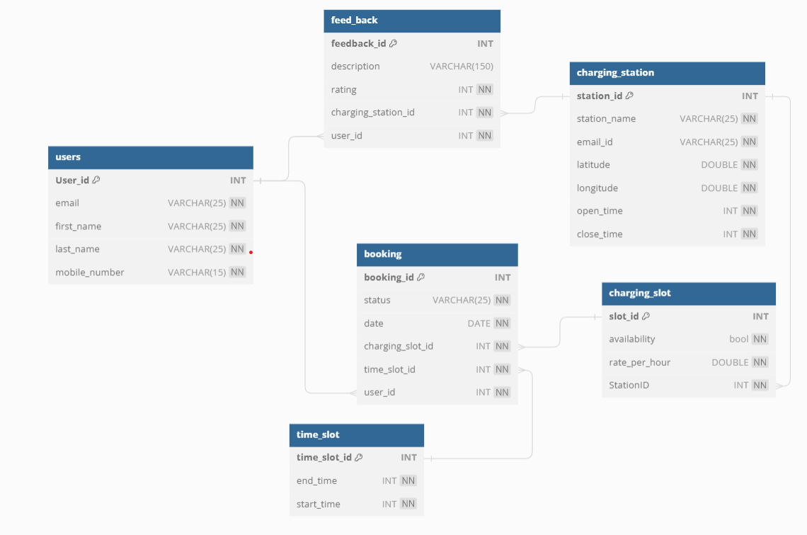

# EV_Station_Backend_Design

The EV station project is focused on online booking for user on ev station.

### POSTMAN API DOCS
### Localhost
https://documenter.getpostman.com/view/26937018/2sA2xmTAEL

### EC2 (server)
https://documenter.getpostman.com/view/26937018/2sA2xmTATS

### JIRA Board
https://vinod-mali.atlassian.net/jira/core/projects/ES/board

### Database Repo

https://github.com/harshalbbd/database_cicd

### Database diagram

### Steps To Create EC2 Using Terraform
- Download Aws Cli and terraform and add the path into system env variables
- Create I AM user with permission of Administrator access
- Create Access Key for User to connect with terraform cli
- Configure Profile of User
- aws configure --profile user_name
- add the access keys and access secret key and region
- create a terraform file and configure it with the setting
- enter the command in directory of terraform file
- terraform init
- terraform apply
- The EC2 will be created in aws rds
